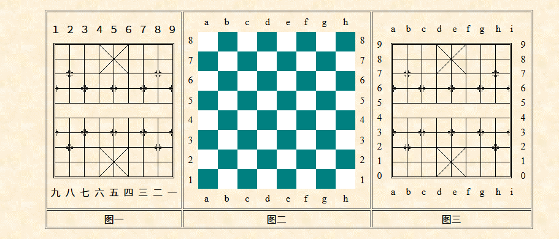

# 中国象棋支招App
基于yolo自训练的jj象棋模型，进行棋子识别，利用opencv进行棋盘网格识别，利用皮卡鱼进行象棋推理，得到最佳走法

## cli 主要用于验证
```shell
java -jar cli/target/app.jar <image-file-path>
```
## Android
支持安卓手机

# FEN 格式
局面表达式，通过一个fen串，就能表示某一个象棋局面，也是象棋引擎需要的格式
https://www.xqbase.com/protocol/cchess_move.htm



红色大写，黑色小写

# 引擎
https://www.pikafish.com

根据 引擎介绍.txt 

大多数情况下，引擎速度：vnni512>avx512>avx512f>avxvnni>bmi2>avx2>sse41-popcnt>ssse3 棋友根据自己的CPU选择相应的引擎


## 命令行
https://blog.csdn.net/gitblog_01232/article/details/143039330
https://github.com/official-pikafish/Pikafish/wiki/UCI-&-Commands

引擎通过命令行调用， 如：
```
uci

uci newgame

position fen r2ak1b1r/4a4/2n1b1nc1/p1p1p1p1p/2c6/6P2/P3P3P/N1CC2N2/9/1RBAKAB1R w
```
go depth 20

