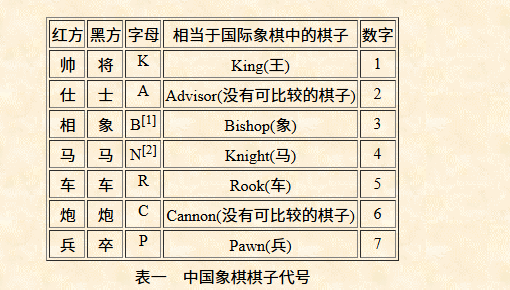

# 接口 （有些局面不全）
https://www.chessdb.cn/cloudbook_api.html

# FEN 格式
https://www.xqbase.com/protocol/cchess_move.htm

# 引擎
https://www.pikafish.com

## 命令行
https://blog.csdn.net/gitblog_01232/article/details/143039330

uci

ucinewgame

position fen r2ak1b1r/4a4/2n1b1nc1/p1p1p1p1p/2c6/6P2/P3P3P/N1CC2N2/9/1RBAKAB1R w

go depth 20
